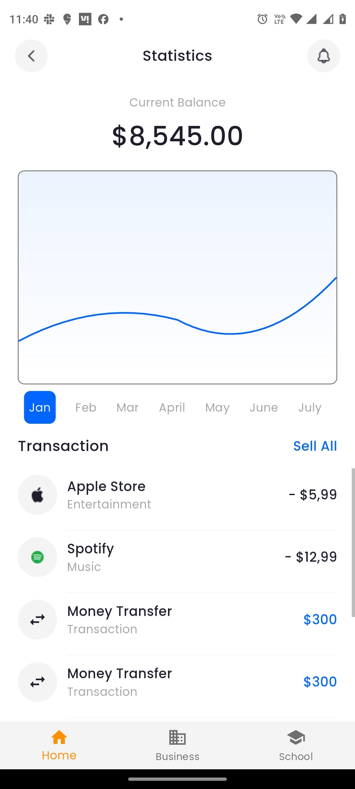

# Screens

 

## Time Breakdown

The total time taken to create production ready screens is **5.5hrs**. Below is a detailed breakdown of the time spent on each feature:

| **Efforts**            | **Time Spent** |
|------------------------|----------------|
|      Manual Coding, using project specs from Figma, requirements doc and Postman         | 22 hrs        |
| Automation of tasks using HuTouch to code             | 5.5 hrs        |
| **Time Saved**              |**16.5 hrs**|

By using HuTouch, I saved **75%** of my time on building this app.

## Coding Standards used for the app
*Below are the coding practices I followed while developing this project.*

**Architecture**
- Modular, inspired by MVVM, using GetX for state management.

**State Management**
- GetX efficiently handles UI updates via observable states.

**Code Structure**
- Organized under `lib`, with feature modules, utilities, and shared UI components.

**Constants Management**
- Static values centralized in classes (`AppString`, `ImagesAsset`) for maintainability.

**Responsive Design**
- Adapts using flexible UI attributes within Flutter's framework.

**Error Handling**
- Uses `showErrorMessage` for basic snackbar-based error reporting.

**Localization**
- No explicit support for multiple languages.

**Memory Optimization**
- `const` constructors and cleanup methods like `clearCart()` improve performance.

**Libraries & Frameworks**
- Built with Flutter; GetX for state management and Material Design for UI.

**Coding Practices**
- Well-structured, readable, modular, minimal commenting, clear naming.

## Screenshots

*Screenshots of the application's output will be added here.*

    

        <b>Generated Output</b>
        
    

---
