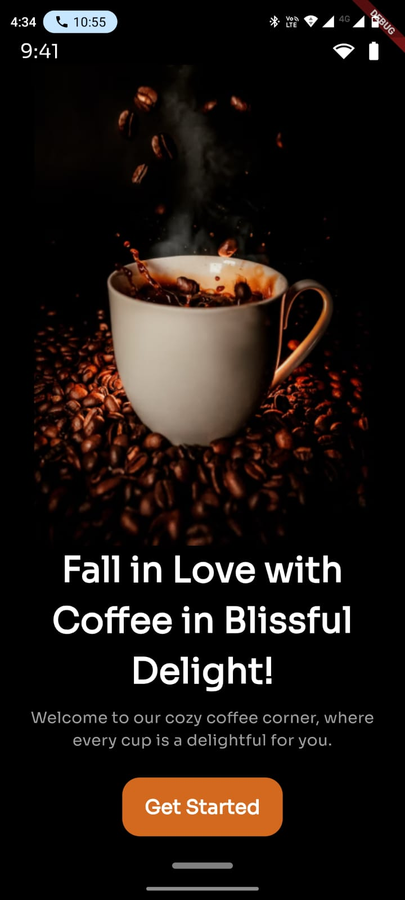
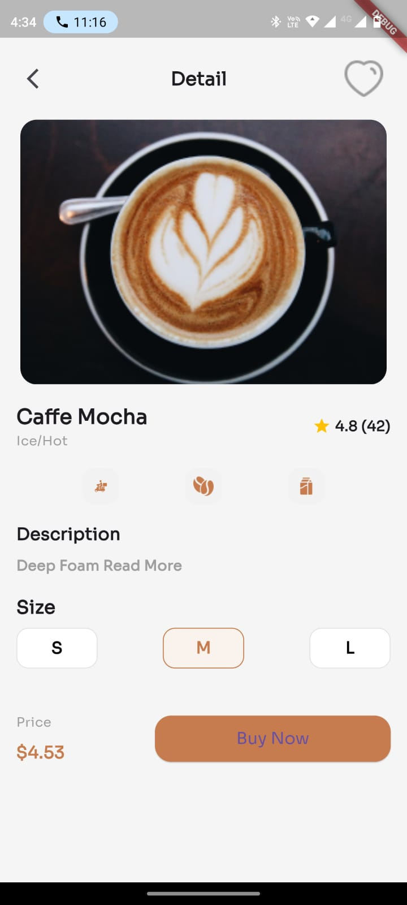
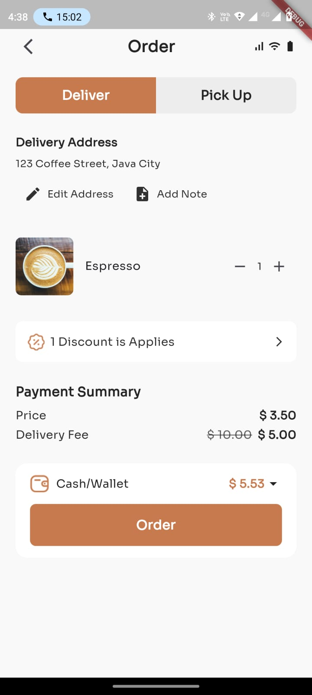
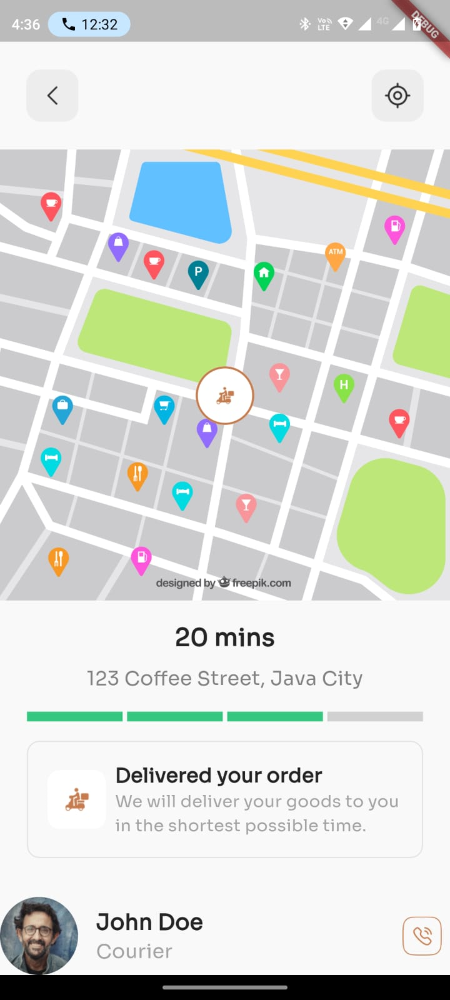

# Profile screen

## Time Breakdown

The total time taken to generate the code was **14 minutes (0.46 hours)**. Below is a detailed breakdown of the time spent on each feature:

| **Feature**  | **Time Spent** |
| ------------ | -------------- |
| Home screen  | 7 mins         |
| Manual fixed | 7 mins         |
| **Total**    | **14 mins**    |

## Test Coverage

The project achieved **91% pass rate** for unit test cases covering UI, functionality and coding standards without the need for manual coding. Detailed test results can be found in the [pass percentage.xlsx](https://docs.google.com/spreadsheets/d/18iIV-06H9lXpGDIvOGt6IRi3vje-wyR-/edit?usp=sharing&ouid=116493966492613948949&rtpof=true&sd=true) file.

## Screenshots

_Screenshots of the application's output will be added here._

    

        <b>Onboarding Screen</b>
        
    

    

        <b>Home Screen</b>
        
    

    

        <b>Product Details Screen</b>
        
    

    

        <b>Order Screen</b>
        
    

    

        <b>Tracking Screen</b>
        
    

