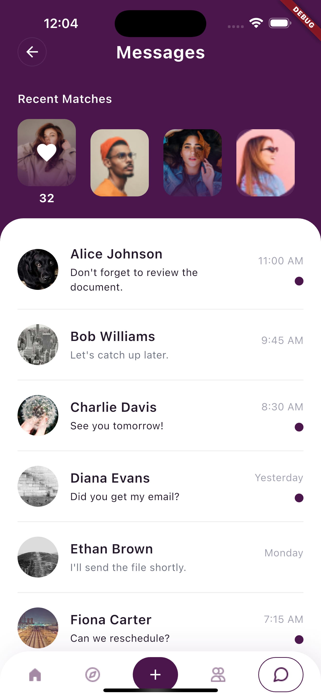

# Messaging Screen

 

## Time Breakdown

The total time taken to generate the code was **26 minutes (0.43 hours)**. Below is a detailed breakdown of the time spent on each feature:

| **Feature**            | **Time Spent** |
|------------------------|----------------|
| Home Screen            | 15 mins        |
| Api Integration        | 09 mins        |
| Manual fixed           | 02 mins        |
| **Total**              | **26 mins**   |

## Test Coverage

The project achieved **78% pass rate** for unit test cases covering UI, functionality, Api Integration and coding standards without the need for manual coding. Detailed test results can be found in the [MessageScreen.xlsx](https://1drv.ms/x/s!AthfF84wlZIJgrh4w3955V8AXL92cA?e=AtRpcT) file.

## Screenshots

*Screenshots of the application's output will be added here.*

    

        <b>Home Screen</b>
        
    

## Upskill result

This document provides detailed instructions and is part of the upskilling initiative from HuTouch.: [Upskill.txt](upskill.txt)

## Video Recording

To view the video recording of the application, use the player below:
[Play in New Tab](https://1drv.ms/v/s!AsIYr21agSvAhftVZ4cLuNsAXbuVVg?e=cZxeRO)

[View Video](https://1drv.ms/v/s!AslYr21agSvAhftVWiV5NMWO_j6-4g?embed=1)

---
