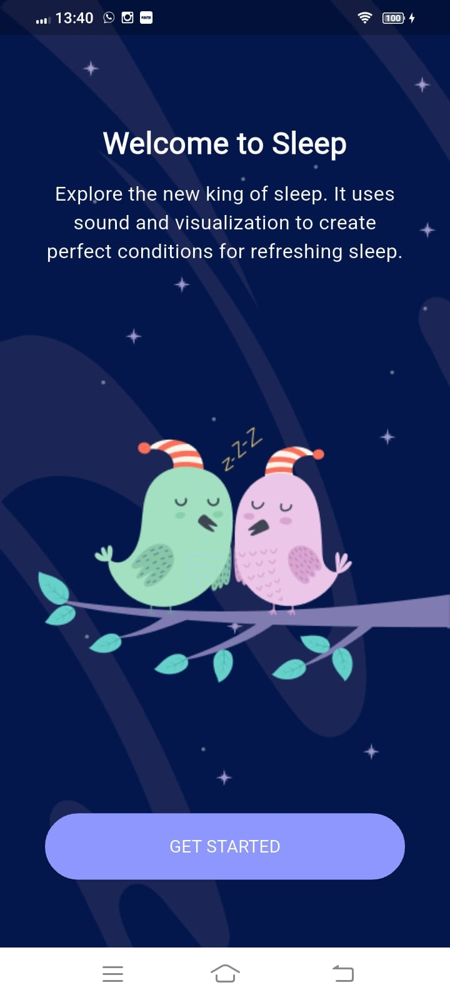
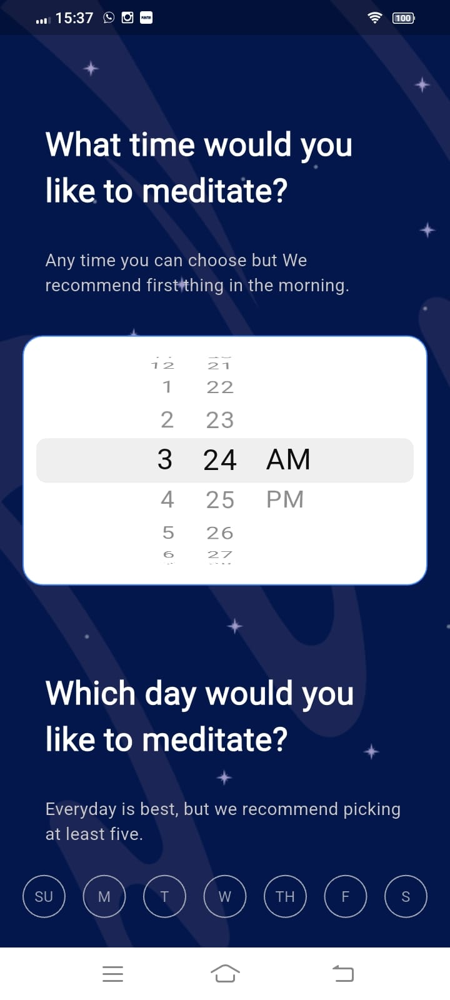
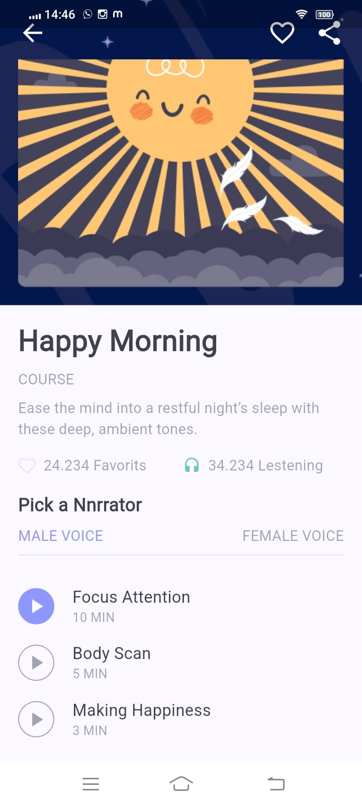

# Meditation App

## Time Breakdown

The total time taken to generate the code was **36 minutes**. Below is a detailed breakdown of the time spent on each feature:

| **Feature**            | **Time Spent** |
|------------------------|----------------|
| welcome sleep screen         | 7 mins        |
| reminder screen        | 10 mins        |
| course screen          | 8 mins        |
| Api Integration        | 6 mins        |
| Manual fixed           | 5 mins        |
| **Total**              | **36 mins**   |

## Screenshots

*Screenshots of the application's output will be added here.*

    

        <b>Welcome sleep screen</b>
        
    

    

        <b>Reminder screen</b>
        
    

    

        <b>Course details screen</b>
        
    

## Upskill result

This document provides detailed instructions and is part of the upskilling initiative from HuTouch.: [Upskill.txt](code_review_meditationapp.txt)
---
