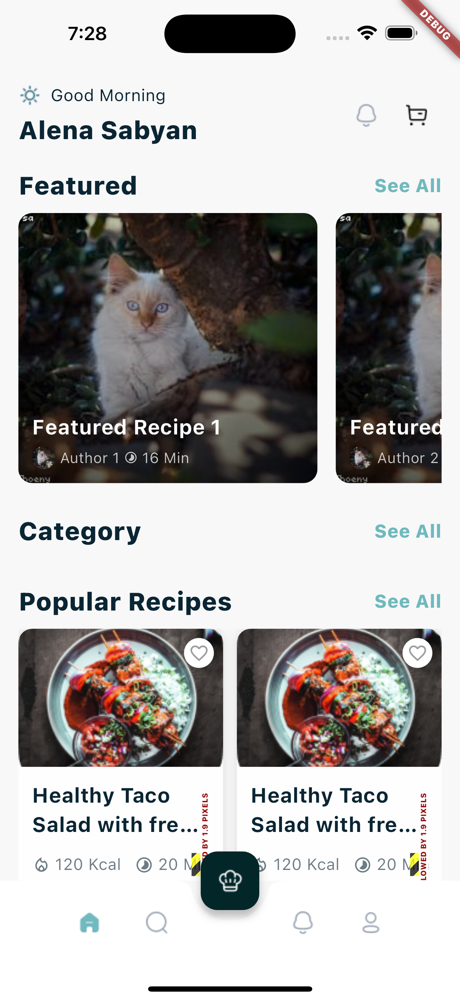
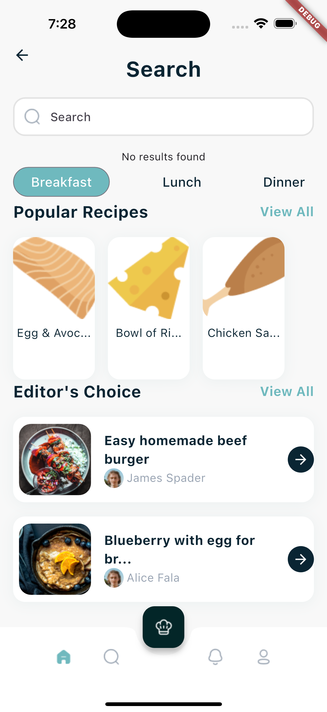

# Recipely App

 ?node-id=1-2&node-type=canvas&t=zvuA8Ww6nznSI49W-0)

## Time Breakdown

The total time taken to generate the code was **91 minutes (1.51 hours)**. Below is a detailed breakdown of the time spent on each feature:

| **Feature**            | **Time Spent** |
|------------------------|----------------|
| Login Screen           | 09 mins        |
| Home Screen with 3 Api | 35 mins        |
| Search Screen with 1 Api          | 18 mins        |
| Account Screen with 1 Api         | 17 mins        |
| Recipe Detail Screen   | 12 mins        |
| **Total**              | **91 mins**   |

## Test Coverage

The project achieved **81% pass rate** for unit test cases covering UI, functionality, Api Integration and coding standards without the need for manual coding. Detailed test results can be found in the [TestCases.xlsx](https://1drv.ms/x/c/09929530ce175fd8/EaGrP20Gk4dPmBum3GSkDy0BY0zd7zVQ5JkteBR_OIq4Xw?e=DjDhPz) file.

## Screenshots

*Screenshots of the application's output will be added here.*

    

        <b>Home Screen</b>
        
    

    

        <b>Recipe Search</b>
        
    

    

        <b>Recipe Detail</b>
        
    

---
