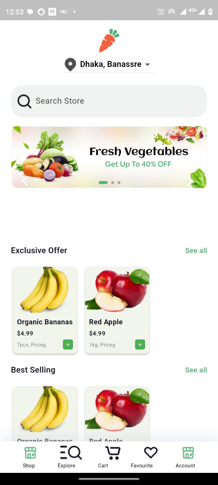
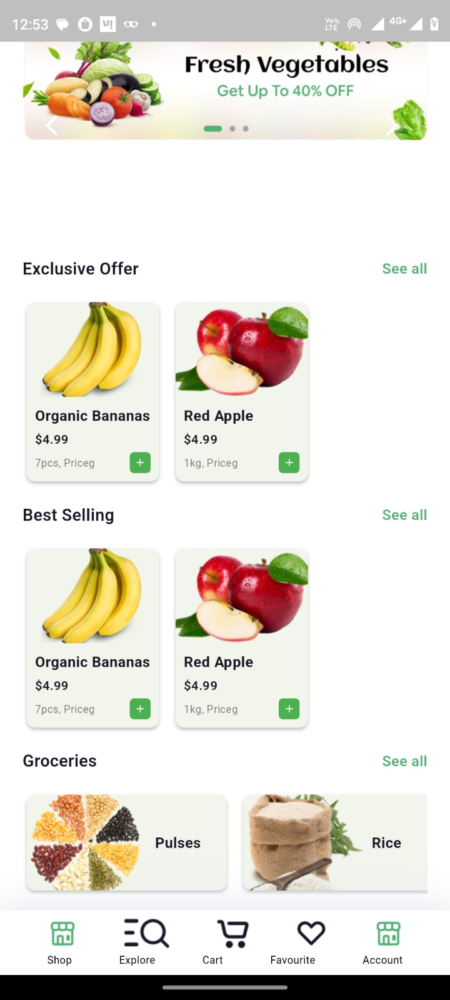
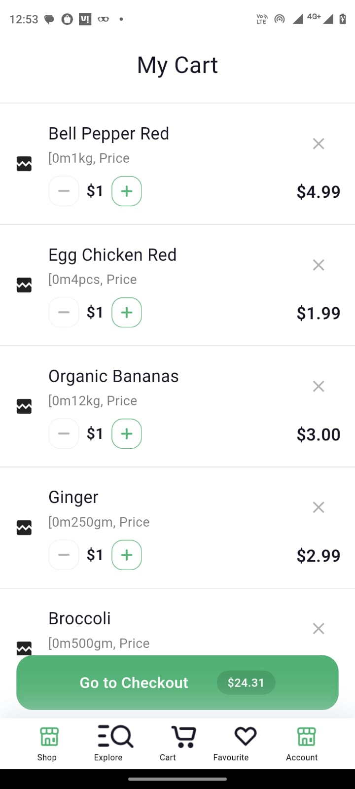

# Screens

 

## Time Breakdown

The total time taken to generate the project was **1 hr 30 mins**. Below is a detailed breakdown of the time spent on each feature:

| **Feature**            | **Time Spent** |
|------------------------|----------------|
| Home Page              | 50 mins        |
| Cart page              | 35 mins        |
| **Total**              |**1 hr 30 mins**|

## Screenshots

*Screenshots of the application's output will be added here.*

    

        <b>Home Page</b>
        
        
    

    

        <b>Cart Page</b>
        
    

---
