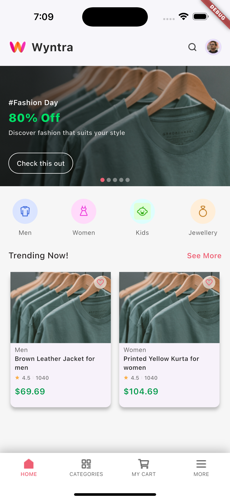
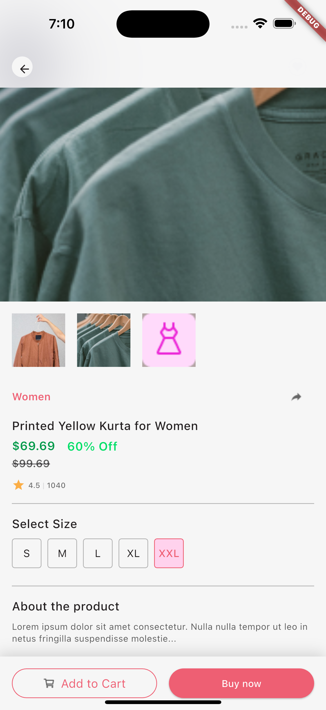
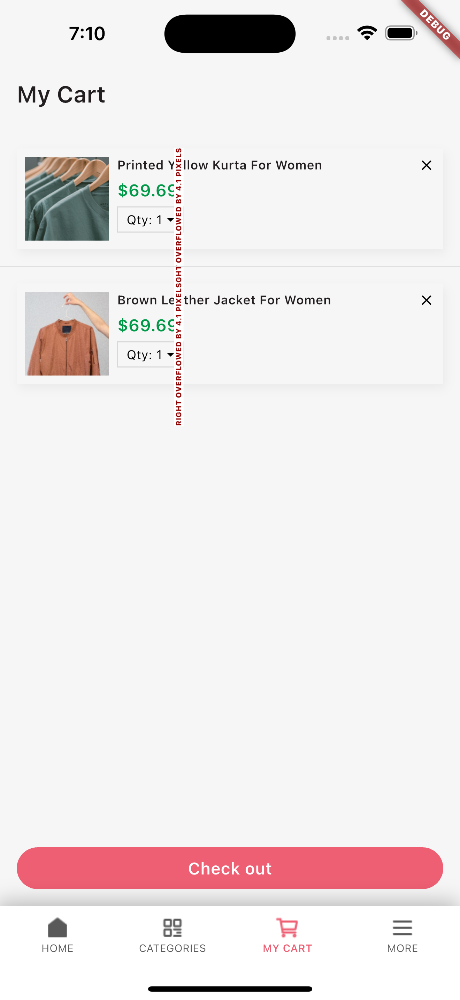

# Ride Share APP

🔗 [Figma UI used](https://www.figma.com/design/VMCKEkon7dShGclzoWcVMr/Myntra-App-Redesign-(Community)?node-id=0-1&node-type=canvas&t=lygAu7SSbS5552LB-0)

## Time Breakdown

The total time taken to generate the code was **84 minutes (1.4 hours)**. Below is a detailed breakdown of the time spent on each feature:

| **Feature**            | **Time Spent** |
|------------------------|----------------|
| Home Screen            | 23 mins        |
| Product Screen         | 30 mins        |
| Cart screen            | 31 mins        |
| **Total**              | **84 mins**   |

## Test Coverage

As part of the upskilling initiative, the project achieved **82% pass rate** for unit test cases covering UI, functionality, and coding standards without the need for manual coding. Detailed test results can be found in the [RideShare.xlsx](/RideShare.xlsx) file.

## Screenshots

*Screenshots of the application's output will be added here.*

    

        <b> Home Screen</b >
        
    

    

       <b> Product Screen </b>
        
    

    

       <b> Cart Screen </>
        
    

## Upskill result

This document provides detailed instructions and is part of the upskilling initiative from HuTouch.: [Upskill.txt](upskill.txt)

---

<!--  -->
