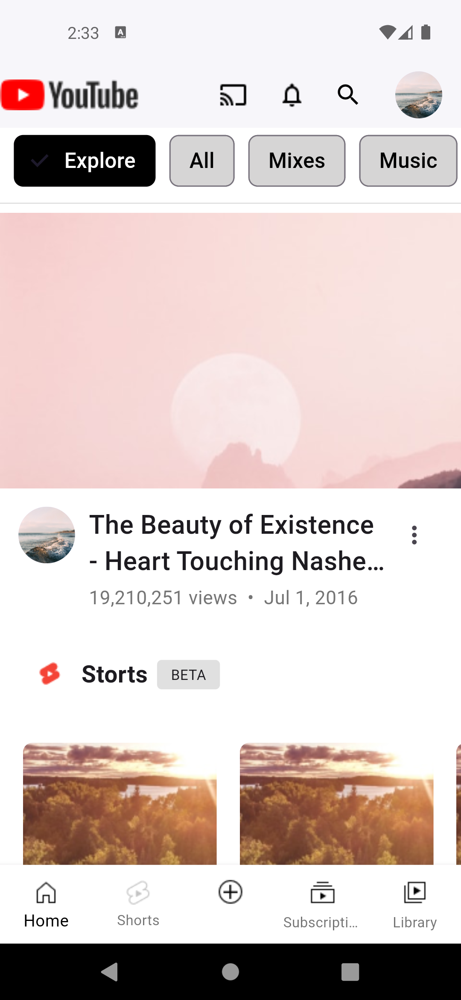
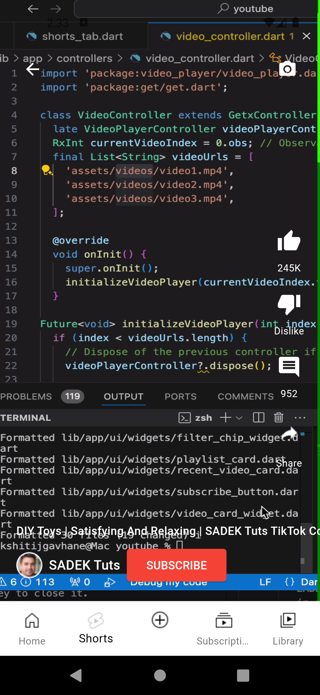
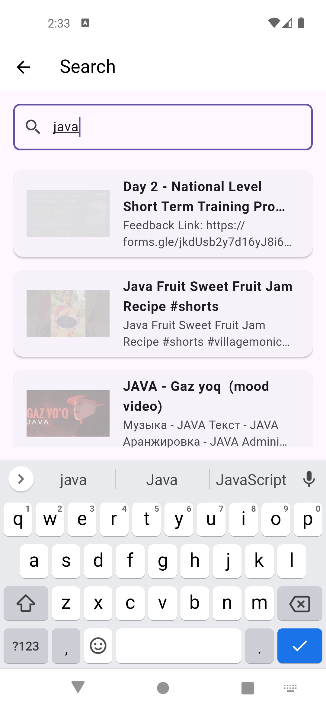
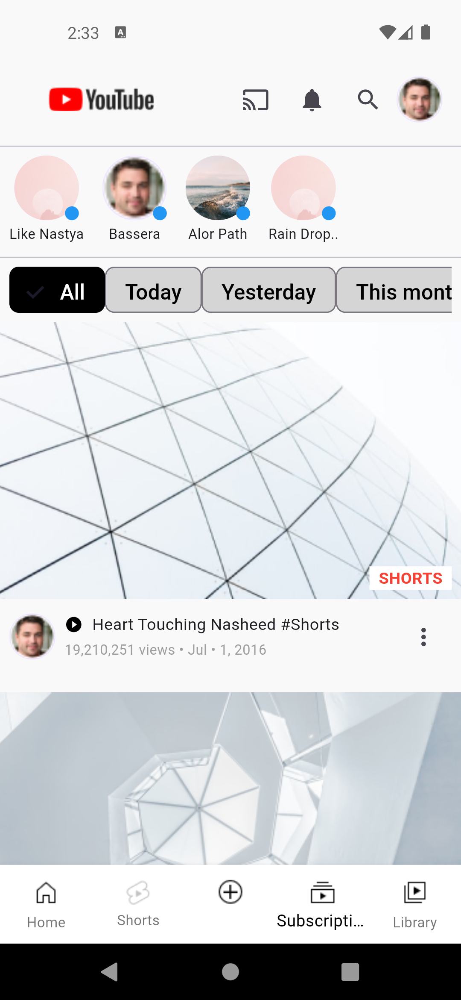
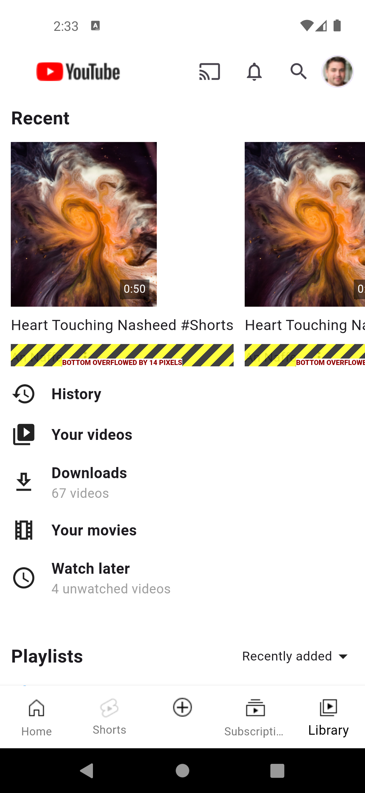

# Youtube Dummy App

    
    

## Time Breakdown

The total time taken to generate the code was **77 minutes (1.28 hours)**. Below is a detailed breakdown of the time spent on each feature:

| **Feature**            | **Time Spent** |
|------------------------|----------------|
| Home Screen           | 14 mins        |
| Shorts Screen     | 18 mins        |
| Subscription Screen           | 11 mins        |
| Library Screen        | 14 mins        |
| Search Screen with API  | 20 mins        |
| **Total**              | **77 mins**   |

## Test Coverage

The project achieved **85% pass rate** for unit test cases covering UI, functionality, Api Integration and coding standards without the need for manual coding. Detailed test results can be found in the [TestCases.xlsx](https://1drv.ms/x/c/09929530ce175fd8/EQm6w1JxdxdBp6Bz7VI4LroBNZIv0tIzTdqYXho6XqEydw?e=1BdJOU) file.

## Screenshots

*Screenshots of the application's output will be added here.*

    

        <b>Home</b>
        
    

    

        <b>Shorts</b>
        
    

    

        <b>Search(Ytb API)</b>
        
    

        

        <b>Subscription</b>
        
    

        

        <b>Library</b>
        
    

## Upskill result

This document provides detailed instructions and is part of the upskilling initiative from HuTouch.: [Upskill.txt](upskill.txt)

---

